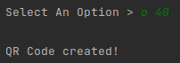
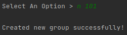
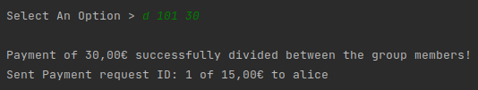

# Money Exchange App :money_with_wings:

<b>Disclaimer: This repository is a public display-only version of a private repository. </b>


Money Exchange App is a distributed Client-Server Java App.

The Server Application has access to the accounts of the registered users and offers different types of functionalities
regarding money exchange.

Users are required to use the Client App to interact with the server.

## Functionalities

Here are some possible use-case scenarios between user John and Alice!

### [B]alance

> Check your balance. <br /><br/>
> 

### [M]akePayment [userID] [amount]

> Make a payment of **amount** to a user with **userID**.
>
> *Note*: For security purposes, the user signs a string containing the receiving user and amount in order to prove his
> identity.<br /><br />
> User John:<br/>
<br/><br />
> User Alice after John makes the payment (initial balance was 100 €):<br/>


### [R]equest Payment [userID] [amount]

> Request a payment of **amount** to a user with **userID**.<br /><br/>
> User John:<br/>
<br/><br/>
> User Alice after John requests the payment (using v as viewRequests):<br/>


### [V]iewRequests

> View all your pending payment requests. <br /> <br />


### [P]ayRequest [reqID]

> Pay a pending request with the id of **reqID**<br /><br />
<br /><br />
> User John after Alice paid the request of 15 € (initial balance was 100 €):<br />


### [O]btainQRcode [amount]

> Create a payment request of **amount** and generate a QR code for it. If read, the QR code displays the ID of the
> generated payment request.<br /><br />
<br /><br />
> Generated QRCode (can be found in /resources/qrcodes):<br />


### [C]onfirmQRcode [QRcode]

> Pay a payment request with the id of **QRCode**, which is obtained by reading a previously created QRCode using [O]
> btainQRcode. <br /><br />
> Based on the previously created QRCode (which when read, displays the ID of 0):<br/>
<br /><br />
> User John after Alice paid the QRCode request of 40 € (initial balance was 100 €):<br />


### [N]ewGroup [groupID]

> Create a group with ID of **groupID**.<br /><br />
> User John creates group 101:<br/>


### [A]ddU [userID] [groupID]

> Add user with **userID** to your group with ID of **groupID**.<br /><br />
> User John adds Alice:<br/>


### [G]roups

> Check all the groups that you own and which you've been added to.<br /><br />
> User John checks his groups:<br/>
> <br /><br />
> User Alice checks her groups:<br/>
> 

### [D]ividePayment [groupID] [amount]

> Divide **amount** between all members of the group with ID **groupID**.<br /><br />
> User John divides a payment of 30 €:<br />
> <br /><br />
> User Alice receives payment request:<br />
> 

### [S]tatusPayments [groupID]

> Check pending group payments of the group with ID **groupID**.<br /><br />
> User John checks status:<br/>
> 

### [H]istory [groupID]

> Check all finalized group payments of the group with ID **groupID**.<br /><br />
> Alice pays previously sent group payment request of 15 €:<br/>
> <br /><br />
> John checks history:<br/>
> 

## Security

This app has security in mind.

- All communication made between the client and the server were done using **TLS secure sockets** with unilateral
  authentication;
- Client registration works as follows: Client attempts to connect. Server replies with a nonce value. Client sends the
  received nonce, a signed nonce using the client's private key and the corresponding certificate with the public key.
  Server verifies and registers user.
- Client login works as follows: Client attempts to connect. Server replies with a nonce value. Client signs nonce
  value. Server verifies using the registered client certificate.
- The server has a **keystore** and each user must have a private key inside their own **keystore**;
- The server's public key certificate has been added to a **truststore** which can be used by all users;
- Sensitive transactions are signed by the user;
- The server encrypts all generated data files using its private key;
- The server maintains a secure **blockchain**, where all transactions are stored and the sensitive transactions are
  signed by the creator Every five transactions, the block file is signed & its hash is used for the next block file;

## How to run the server?

*Example*: Open a console inside /jars and type the following:

```java -jar MoneyExchangeServer.jar 123456 keystore.server 123456```

> 123456 is the password for the keystores.<br/>
> Port can be specified as the first argument.<br/>
> If you wish to delete all generated data, simply remove the resources, logs and certificates folders.

## How to run a client?

There are two provided client certificates. Alice's and John's.

*Example*: Run a client as John. Open a console inside /jars and type the following:

```java -jar MoneyExchangeClient.jar 127.0.0.1 truststore.client johnKeyStore 123456 John```

## Disclaimer:

This app displays plenty of security-related information on purpose in order to showcase how its security protocols
work.
